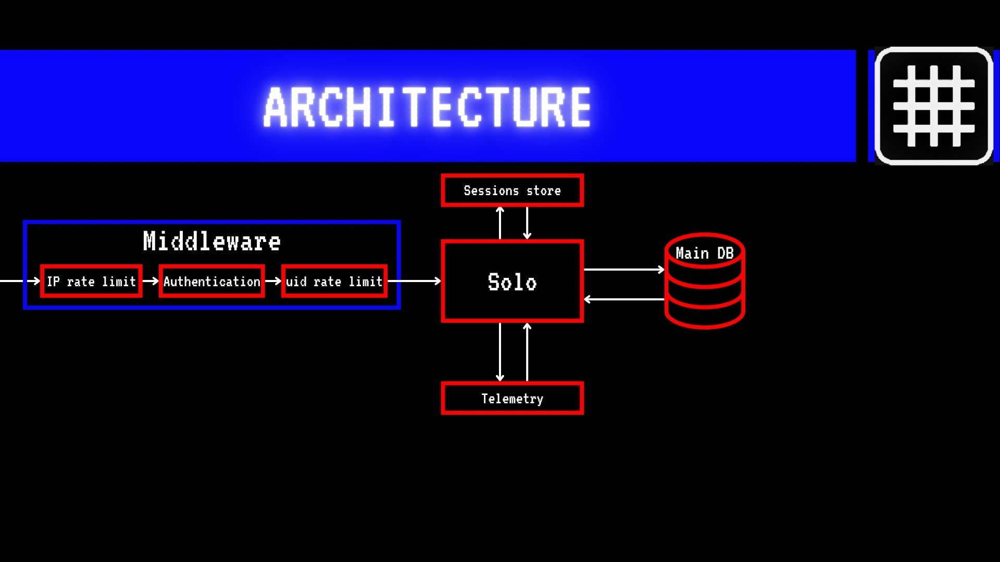

## Components

- **Clients**: Web/mobile/desktop apps consuming session-based APIs.
- **Echo Service (Go)**: Core application server with modular packages for routes, handlers, sessions, business logic, and middleware.
- **Firebase Auth**: Validates tokens and maps to UID for identity.
- **Rate Limiter Middleware**: Two layers: IP-based, then UID-based.
- **Sessions Store**: In-memory cache at first, with Redis integration for scalability.
- **Postgres DB**: Primary system of record, accessed via `sqlc` for type-safe queries.
- **Observability Stack**: Prometheus, OpenTelemetry, logs, dashboards, and alerts.

## Design Rationale

1. **Stateless core, stateful sessions** → the service can scale horizontally since sessions are abstracted into pluggable stores (in-memory → Redis).
2. **Security-first** → Firebase authentication, layered rate limiting, and TLS ensure resilience against abuse.
3. **Observability baked in** → metrics, traces, and structured logs for debugging, scaling, and operations.
